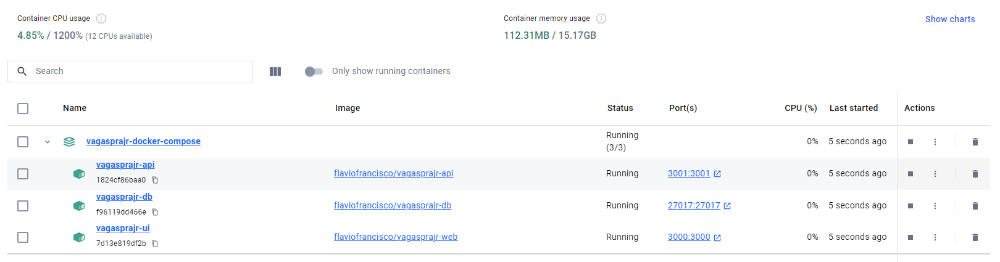

# Welcome to the @vagasprajr's api project!

This documentation has the goal to explain how to use the API and how to run the project locally.

## Requirements

- [Docker Desktop](https://www.docker.com/products/docker-desktop/)
- [Node.js](https://nodejs.org/en/download/package-manager)
- [Go](https://golang.org/)
- Linux Ubuntu 20.04 LTS or Windows with WSL enabled.

## How to run this project using Docker?

### 1. Clone the repository

```bash
git clone https://github.com/flaviofrancisco/vagasprajr-docker-compose.git
```

and follow the instruction in the README file of the repository.

If everything is ok, you should have the following containers in your Docker Desktop:


Running the following containers:

- vagasprajr-api;
- vagasprajr-ui and
- vagasprajr-db

Click on the container `vagasprajr-ui` and access the URL: [http://localhost:3000](http://localhost:3000) to see the project running.

To contribute, you need to Fork this repository and create a Pull Request.

Don't forget to stop the vagasprajr-api to run the project locally.

## How to run the project locally

- Clone this project;

```bash
git clone git@github.com:flaviofrancisco/vagasprajr-api-v2.git
```

- Access the project folder;

```bash
cd vagasprajr-api-v2
```

- Rename the `.env.example` file to `.env` and set the environment variables;

```bash
cp .env.example .env
```

## Install the dependencies

To install the dependencies, you need to run the following command:

```bash
go mod download
```

## Run the project

To run the project, you need to run the following command:

```bash
go run main.go
```


